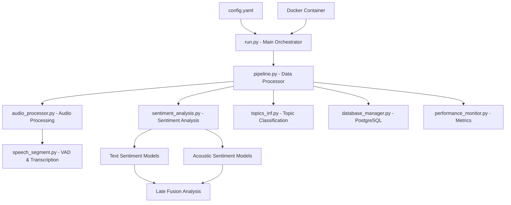

# Audio Processor v1 - Comprehensive Analysis & Documentation

## Project Overview

**Audio Processor** is a production-ready pipeline for large-scale audio processing designed for telecommunications companies. It provides end-to-end processing of customer service calls with:

- **Speech-to-Text Transcription** using Wav2Vec2Bert models fine-tuned for Darija (Moroccan Arabic)
- **Multi-modal Sentiment Analysis** (Text + Acoustic features with late fusion)
- **Topic Classification** using AWS Bedrock Claude models
- **Voice Activity Detection** (VAD) for speaker separation
- **Database Integration** with PostgreSQL for persistent storage
- **Performance Monitoring** with comprehensive metrics tracking
- **Containerized Deployment** with Docker support

---

## Architecture Deep Dive

### Core Components



### Processing Pipeline Flow

1. **File Discovery & Validation** (`AudioFileScanner`)
   - Parallel scanning of `.wav` and `.ogg` files
   - Header validation using `torchaudio.info`
   - File size and format checks

2. **Audio Loading & Preprocessing** (`AudioProcessor`)
   - Memory-mapped loading for `.wav` files
   - FFmpeg-based conversion for `.ogg` files
   - Resampling to 16kHz target sample rate
   - Channel separation (agent/client) or mono processing

3. **Voice Activity Detection** (`SpeechSegment`)
   - PyAnnote VAD pipeline for speaker detection
   - Configurable segment duration and overlap
   - Optimized batching for GPU processing

4. **Speech Transcription** (`SpeechBatchTranscriber`)
   - Wav2Vec2Bert model fine-tuned for Darija
   - Batch processing with dynamic padding
   - Mixed precision support for CUDA
   - Text cleaning and normalization

5. **Sentiment Analysis** (`SentimentAnalyzer`)
   - **Text Sentiment**: HuggingFace transformers for client/agent
   - **Acoustic Sentiment**: Classical ML models (SVM/RandomForest) with feature extraction
   - **Late Fusion**: Probability-based combination of modalities
   - Batch processing for efficiency

6. **Topic Classification** (`TopicClassifier`)
   - AWS Bedrock integration with Claude models
   - Pre-summarization in French
   - Constrained classification using business glossaries
   - Separate B2B/B2C topic catalogs

7. **Data Persistence** (`DatabaseManager`)
   - PostgreSQL with call and chunk tables
   - Upsert operations for idempotency
   - Foreign key relationships and indexing
   - Batch insertions for performance

8. **Performance Monitoring** (`PerformanceMonitor`)
   - Real-time resource monitoring (CPU, Memory, GPU)
   - Processing metrics and throughput tracking
   - Bottleneck identification
   - JSON report generation

---

##  Technical Specifications

### Performance Characteristics
- **Throughput**: ~600 files/hour (estimated, depends on file length and hardware)
- **Memory Usage**: Configurable up to 500GB with 80% threshold management
- **GPU Acceleration**: CUDA support with mixed precision 
- **Parallel Processing**: 32 workers for I/O, 32 for batch processing
- **Batch Sizes**: 8 files/batch, 16 chunks/GPU batch

### Model Requirements
- **Transcription**: Wav2Vec2Bert (Darija fine-tuned)
- **Text Sentiment**: Client/Agent specific HuggingFace models
- **Acoustic Sentiment**: SVM (client) + RandomForest (agent) with scalers
- **VAD**: PyAnnote voice-activity-detection
- **Topic Classification**: AWS Bedrock Claude 3.5 Sonnet

### Hardware Requirements
- **Minimum**: 64GB RAM, 4 CPU cores
- **Recommended**: 64GB+ RAM, 16+ CPU cores, NVIDIA GPU (80GB+ VRAM)
- **Storage**: SSD recommended for model loading and temporary files
- **Network**: Internet access for AWS Bedrock (topic classification)

---

##  Quick Start Guide

### Prerequisites
```bash
# System dependencies
sudo apt-get update && sudo apt-get install -y ffmpeg

# Python dependencies
pip install -r requirements.txt

# Optional: PostgreSQL setup
docker run -d --name postgres-audio \
  -e POSTGRES_DB=audio_processing \
  -e POSTGRES_USER=postgres \
  -e POSTGRES_PASSWORD=your_password \
  -p 55432:5432 postgres:13
```

### Configuration
1. **Copy environment template**:
   ```bash
   cp env.example .env
   # Edit .env with your AWS credentials
   ```

2. **Update model paths in `config.yaml`**:
   - Ensure all model paths are accessible
   - Configure database connection if using PostgreSQL
   - Adjust batch sizes based on your hardware

3. **Prepare input data**:
   ```bash
   mkdir -p input output logs
   # Place your .wav/.ogg files in ./input/
   ```

### Running the Pipeline

**Basic execution**:
```bash
python run.py --config config.yaml --save-mode database --performance-report
```

**CSV output only**:
```bash
python run.py --config config.yaml --save-mode csv --performance-report
```

**Dry run (validation only)**:
```bash
python run.py --config config.yaml --dry-run
```

**Docker deployment**:
```bash
docker build -t audio-processor .
docker run -v $(pwd)/input:/app/input \
           -v $(pwd)/output:/app/output \
           -v $(pwd)/logs:/app/logs \
           audio-processor
```

### Scheduled Processing
```bash
# Make executable
chmod +x run_cron.sh

# Add to crontab for daily processing at 2 AM
echo "0 2 * * * cd $(pwd) && ./run_cron.sh >> ./logs/cron_driver.log 2>&1" | crontab -
```

---

## Project Structure Analysis

```
audio_processor_v1/
├──  Core Processing
│   ├── run.py                    # Main orchestrator with CLI interface
│   ├── pipeline.py               # DataProcessor with batch management
│   ├── audio_processor.py        # Audio I/O and chunk processing
│   ├── sentiment_analysis.py     # Multi-modal sentiment analysis
│   ├── speech_segment.py         # VAD and batch transcription
│   └── topics_inf.py            # AWS Bedrock topic classification
├──  Data & Configuration
│   ├── config.yaml              # Main configuration file
│   ├── database_manager.py      # PostgreSQL integration
│   ├── performance_monitor.py   # Resource monitoring
│   └── utils.py                 # Helper functions
├── Data Directories
│   ├── input/                   # Audio files (.wav, .ogg)
│   ├── output/                  # Results (CSV, JSON reports)
│   └── logs/                    # Processing logs
├──  Deployment
│   ├── Dockerfile               # Container configuration
│   ├── requirements.txt         # Python dependencies
│   ├── run_cron.sh             # Cron job wrapper
│   └── env.example             # Environment template
└──  Documentation
    ├── README.md               # Original documentation
    ├── glossaire B2C.xlsx      # B2C topic glossary
    └── glossaire B2B.xlsx      # B2B topic glossary
```

---

##  Configuration Deep Dive

### Key Configuration Sections

#### Processing Parameters
```yaml
# Parallel Processing
max_workers: 32                # Batch-level parallelism
io_workers: 32                 # I/O thread pool size
gpu_workers: 1                 # Fixed at 1 to avoid model conflicts

# Memory Management
max_memory_gb: 500.0          # Maximum memory usage
memory_threshold_percent: 80   # Cleanup threshold
chunk_cache_size: 1000        # Number of cached chunks

# Batching Optimization
file_batch_size: 8            # Files processed per batch
chunk_batch_size: 16          # Chunks per GPU inference
chunk_duration_sec: 25        # Audio chunk duration
overlap_sec: 1                # Overlap between chunks
```

#### Model Paths
```yaml
# Transcription
transcription_model: "/path/to/w2v-bert-darija-finetuned-clean"

# Sentiment Analysis Models
client_text_model_path: "/path/to/client/text/best_model"
agent_text_model_path: "/path/to/agent/text/best_model"
client_acoustic_model_path: "/path/to/client/acoustic/svm_acoustic_model.joblib"
agent_acoustic_model_path: "/path/to/agent/acoustic/randomforest_acoustic_model.joblib"

# Scalers for acoustic features
client_acoustic_scaler_path: "/path/to/client/acoustic/acoustic_scaler.joblib"
agent_acoustic_scaler_path: "/path/to/agent/acoustic/acoustic_scaler.joblib"
```

#### Database Configuration
```yaml
database_type: "postgresql"
db_host: "localhost"
db_port: 55432
db_name: "audio_processing"
db_user: "postgres"
db_password: "your_password"
```

---

## 📈 Performance Analysis & Monitoring

### Metrics Tracked
- **Processing Speed**: Files/hour, audio duration/hour
- **Resource Usage**: CPU, Memory, GPU utilization
- **Error Rates**: Failed files, chunk processing errors
- **Bottlenecks**: I/O wait times, model inference times
- **Memory Patterns**: Peak usage, garbage collection efficiency

### Output Files
- **CSV Results**: `optimized_results_YYYYMMDD_HHMMSS.csv`
- **Performance Reports**: `performance_report_YYYYMMDD_HHMMSS.json`
- **Failed Calls**: `failed_calls_YYYYMMDD_HHMMSS.json`
- **File Statuses**: `file_statuses_YYYYMMDD_HHMMSS.json`
- **Processing Logs**: `optimized_processing_*.log`

### Sample Output Schema
```csv
file_name,transcription,agent_transcription,client_transcription,
agent_text_sentiment,agent_text_confidence,agent_text_probabilities,
client_text_sentiment,client_text_confidence,client_text_probabilities,
agent_acoustic_sentiment,agent_acoustic_confidence,agent_acoustic_probabilities,
client_acoustic_sentiment,client_acoustic_confidence,client_acoustic_probabilities,
agent_fusion_sentiment,agent_fusion_confidence,
client_fusion_sentiment,client_fusion_confidence,
error,topics

##  License

Proprietary - All rights reserved.


